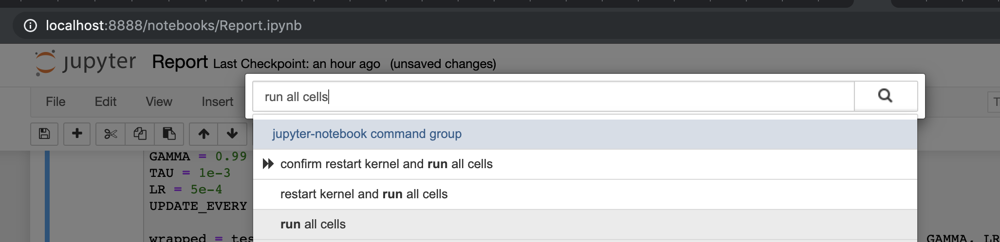

# Udacity Deep Reinforcement Learning Nanodegree Navigation Project
This repository contains the code that is submitted as project 1 (p1 - Navigation) of Udacity's Deep Reinforcement Learning Nanodegree

## Project Overview
For this project, you will train an agent to navigate (and collect bananas!) in a large, square world.

A reward of +1 is provided for collecting a yellow banana, and a reward of -1 is provided for collecting a blue banana. Thus, the goal of your agent is to collect as many yellow bananas as possible while avoiding blue bananas.

The state space has 37 dimensions and contains the agent's velocity, along with ray-based perception of objects around the agent's forward direction. Given this information, the agent has to learn how to best select actions. Four discrete actions are available, corresponding to:

- 0 - move forward.
- 1 - move backward.
- 2 - turn left.
- 3 - turn right.

The task is episodic, and in order to solve the environment, your agent must get an average score of +13 over 100 consecutive episodes.

### Folder Structure

```
├── LICENSE
├── README.md
├── Report.ipynb ' Executable notebook 
├── Report.pdf   ' Exported report
├── checkpoint-100000.pth
├── checkpoint-100000x32.pth
├── checkpoint-200000.pth
├── checkpoint-200000x32.pth
├── checkpoint-250000.pth
├── checkpoint-250000x32.pth
├── checkpoint-fastest-reward.pth ' Persisted state of fastest reward
├── documentation
│   └── images
├── envs
│   ├── Banana.app ' MacOS Environment
│   ├── VisualBanana_Linux ' Linux Environment
│   ├── VisualBanana_Windows_x86    ' Windows 32 bit Environment
│   └── VisualBanana_Windows_x86_64 ' Windows 64 bit Environment
│   
└── qnetwork
    ├── __init__.py
    ├── __pycache__
    ├── agent.py ' Implementation of Q Network agent
    └── model.py ' Model of Q Network

```

## Introduction

This project looks into using Deep Reinforcement Learning to train an agent to solve a banana collecting task in an Unity Enviroment.

## Pre-requisites

This project runs as a Jupyter notebook that is ran in a mini-conda enviroment. The following describes the instructions to run the notebook.

### Installing Unity Hub
Follow the instructions and install the Unity Hub that fits your operating system from https://store.unity.com/download

### Installing Miniconda or Anaconda

Anaconda is a free and open-source distribution of Python and R programming languages for scientific computing, that aims to simplify package management and deployment. Miniconda is a slim-down version of Anaconda with less packages included within the installer. The 2 should work similarly with just a different installer download. And Miniconda might require more manual installation of packages. The instructions for installation is found in https://docs.conda.io/projects/conda/en/latest/user-guide/install/index.html#regular-installation and it supports Windows, MacOS and Linux.

### Constructing the Conda environment to run the project

This project specific packages for execution and the versions are locked down to prevent version compatibility issues. A conda environment is constructed to host it so that the host machine is not impacted.

#### Create the Conda environment

Run `conda create --name drlnd-p1 python=3.6` (This is only ran once on every host)

#### Activate the Conda environment

Run `conda activate --name drlnd-p1` (This is ran everytime before activating the Jupyter Notebook server)

#### Install the require Python packages

1. Run `conda install -c conda-forge -c pytorch Pillow matplotlib numpy jupyter pytest docopt pyyaml pytorch pandas scipy ipykernel` to install the following packages:

    - tensorflow
    - protobuf
    - grpcio
    - Pillow
    - matplotlib 
    - numpy
    - jupyter 
    - pytest
    - docopt 
    - pyyaml 
    - pytorch
    - pandas 
    - scipy 
    - ipykernel
2. Run `pip install unityagents` to install Unity Agents

## Running the agent

1. Navigate to the directory containing the project `cd [local repo directory]`
2. Start the Jupyter Notebook server `jupyter notebook`
3. From jupyter server open the file `Report.ipynb`
   
4. Activate the command palette using `cmd / ctrl + shift + p` and Find and execute `run all cells`
   

## Fastest Reward Reached Implementation
The Fastest Reward Reached tested for the selected QNetwork agent uses the following parameters:

Fastest Reward Reached: 520, Best Average Score: 16.51
   1. Seed = 0
   2. Buffer Size = 100,000
   3. Batch Size = 32
   4. Gamma = 0.99
   5. tau = 0.001
   6. lr = 0.0005
   7. Network update frequency = 4

## Possible Improvements

Improvements can be made by changing the implementation of the agent to use the following strategies

1) Double DQN
- Q-Learning has a tendency to overestimate action values. This has a higher chance to occur in the initial stages as the Q-Values are still evolving. Since the Q-Values are realiant are the actions that has been tried and the neighbouring states which had been explored. This creates a chance that an incidental high reward was captured by chance. Double DQN attempts to mediate this by making the parameters used to select the best actions different from the parameters used to evaluate the action selected. Since this acts as 2 function approximators that will reduce the effect the select action on the result if the 2 approximators do not agree on the suitablity of the selected action.
2) Prioritized Experience Replay
- Current implementation uses experience replay by saving experience tuples in buffer that is randomly sampled using a batch in learning. This helps break the correlation between consecutive experiences and stablized the learning algorithm. But some of the learning experiences might be more important than others and they might occur infrequently. If the batches are sampled uniformly then these experiences could have less chance of being selected. And with the fact that buffers have limited capacity older important experiences might get lost when the buffer is recycled. Prioritized Experience Replay looks into assigning a priority to each experience tuple to reduce the impacts of the identified flaws.
3) Dueling DQN
- Uses 2 streams to estimate state value functions and another to estimate the advantage values for each action. The streams might share the initial convolution layers at the start and branch off to its own fully connected layers. The desired Q-values are obtained by combining the state and advantage values. The reason is that value of most states don't vary alot across actions so they can be directly estimated. But the advantage function still allows the capturing the difference actions make in each state.